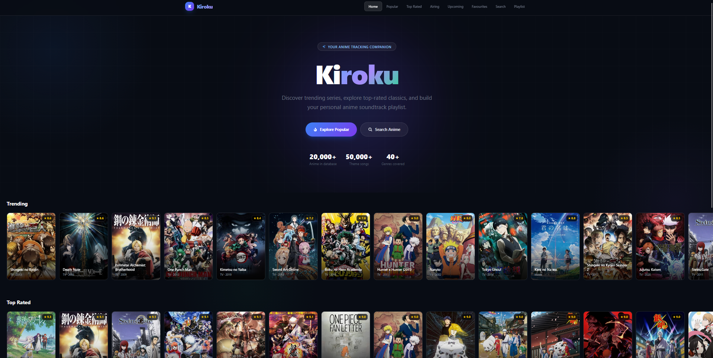
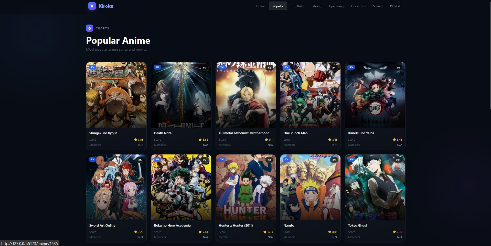
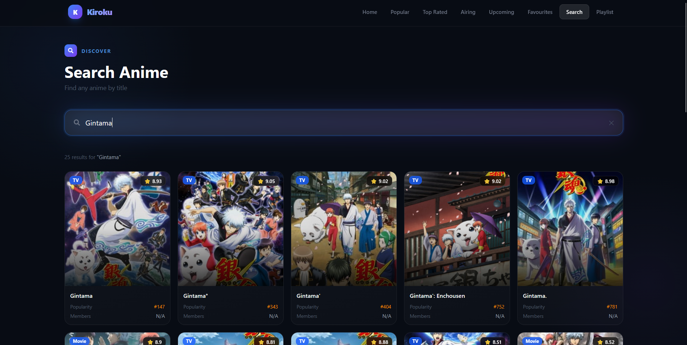
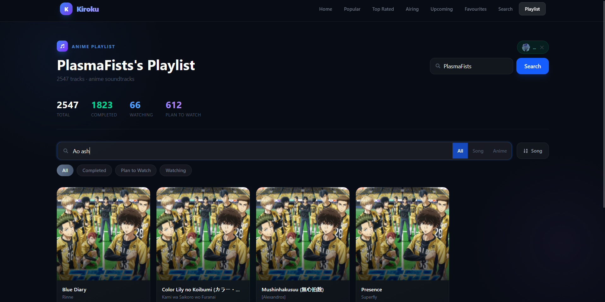
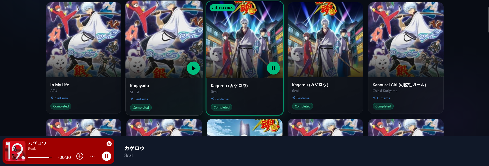
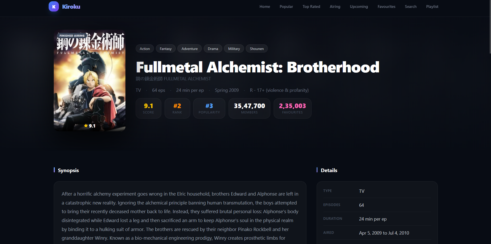
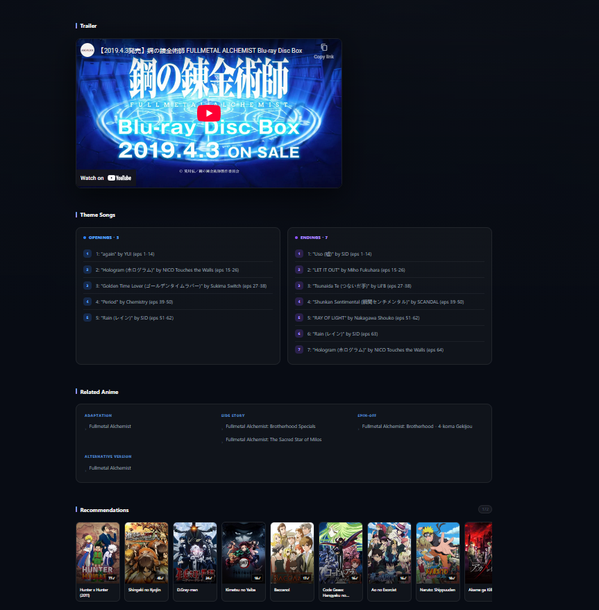

# Kiroku 記録

> A full-stack anime tracking and discovery platform with integrated Spotify soundtrack playlists.

Kiroku lets you browse and discover anime, track your watchlist, and listen to opening/ending themes through your own Spotify account — all in a modern, dark UI.

---

## Features

- **Anime Discovery** — Browse popular, top-rated, currently airing, upcoming, and most-favourited anime
- **Search** — Full-text search across 20,000+ titles with infinite scroll
- **Anime Detail Pages** — Synopsis, information, trailer, characters & voice actors, theme songs, related anime, and recommendations
- **Playlist Maker** — Load any user's anime list and get a full soundtrack playlist from their watchlist, filterable by status and searchable by song or anime name
- **Spotify Integration** — OAuth 2.0 per-user authentication; playback uses the user's own Spotify token — app credentials never exposed to the browser
- **Watchlist Tracking** — Track anime as Completed, Watching, or Plan to Watch with scores

---

## Tech Stack

### Frontend
| Technology | Version |
|---|---|
| React | 19 |
| React Router | 7 |
| Tailwind CSS | 4 |
| Axios | 1.8 |
| Vite | 6 |
| react-icons | 5 |

### Backend
| Technology | Details |
|---|---|
| .NET | 9 (ASP.NET Core) |
| Architecture | Clean Architecture (API / Application / Domain / Infrastructure / Data) |
| Database | PostgreSQL (via Entity Framework Core + Npgsql) |
| Cache | Redis (StackExchange.Redis) |
| External APIs | Spotify Web API, Jikan (MyAnimeList) |
| Docs | Swagger / OpenAPI |

---

## Project Structure

```
Kiroku/
├── frontend/                   # React + Vite SPA
│   └── src/
│       ├── pages/              # Route-level page components
│       ├── skeletons/          # Navbar, AnimeSlider shared components
│       ├── context/            # SpotifyContext, AuthContext
│       ├── components/         # SpotifyBar, ErrorBoundary
│       └── hooks/              # useAnimeData (infinite scroll)
│
└── backend/
    ├── Kiroku.API/             # Controllers, Program.cs, entry point
    ├── Kiroku.Application/     # Services, DTOs, interfaces
    ├── Kiroku.Domain/          # Entities (Anime, User, Character, etc.)
    ├── Kiroku.Infrastructure/  # SpotifyService, RedisCacheService
    └── Kiroku.Data/            # AppDbContext, Migrations, Seeders
```

---

## Getting Started

### Prerequisites

- [Node.js](https://nodejs.org/) 18+
- [.NET 9 SDK](https://dotnet.microsoft.com/)
- [PostgreSQL](https://www.postgresql.org/)
- [Redis](https://redis.io/)
- A [Spotify Developer App](https://developer.spotify.com/dashboard) with a redirect URI set to `http://127.0.0.1:5173/callback`

---

### Backend Setup

1. **Clone the repo and navigate to the backend:**
   ```bash
   cd backend
   ```

2. **Configure `appsettings.Development.json`:**
   ```json
   {
     "ConnectionStrings": {
       "DefaultConnection": "Host=localhost;Database=kiroku;Username=postgres;Password=yourpassword",
       "Redis": "localhost:6379"
     },
     "Spotify": {
       "ClientId": "your_spotify_client_id",
       "ClientSecret": "your_spotify_client_secret",
       "RedirectUri": "http://127.0.0.1:5173/callback"
     }
   }
   ```

3. **Apply database migrations:**
   ```bash
   cd Kiroku.API
   dotnet ef database update
   ```

4. **Run the API:**
   ```bash
   dotnet run
   ```
   The API will be available at `https://127.0.0.1:7171` with Swagger UI at the root.

---

### Frontend Setup

1. **Navigate to the frontend and install dependencies:**
   ```bash
   cd frontend
   npm install
   ```

2. **Configure `vite.config.js`** to proxy API requests to the backend:
   ```js
   export default defineConfig({
     server: {
       host: '127.0.0.1',
       port: 5173,
       proxy: {
         '/api': {
           target: 'https://127.0.0.1:7171',
           changeOrigin: true,
           secure: false,
         }
       }
     }
   })
   ```

3. **Start the dev server:**
   ```bash
   npm run dev
   ```
   The app will be available at `http://127.0.0.1:5173`.

---

## Spotify Integration

Kiroku uses **OAuth 2.0 Authorization Code Flow** — each user connects their own Spotify account:

1. User clicks **Connect Spotify** → redirected to Spotify's login page
2. After authorizing, Spotify redirects back to `/callback` with a one-time code
3. The backend exchanges the code for tokens — the **refresh token is stored server-side in Redis**, never sent to the browser
4. The frontend holds only a short-lived access token **in memory** (never `localStorage`)
5. The access token auto-refreshes 2 minutes before expiry using the stored session ID
6. All Spotify API search calls pass the **user's own Bearer token** — the app's client credentials are never used for user-facing requests

This means Spotify API rate limits are per-user, not per-app, and the app scales without quota concerns.

---

## API Endpoints

| Method | Endpoint | Description |
|---|---|---|
| `GET` | `/api/v1/anime/popular` | Popular anime (paginated) |
| `GET` | `/api/v1/anime/top-rated` | Top rated anime (paginated) |
| `GET` | `/api/v1/anime/airing` | Currently airing (paginated) |
| `GET` | `/api/v1/anime/upcoming` | Upcoming anime (paginated) |
| `GET` | `/api/v1/anime/favourites` | Most favourited (paginated) |
| `GET` | `/api/v1/anime/search?query=` | Search by title |
| `GET` | `/api/v1/anime/:id` | Anime detail (full) |
| `GET` | `/api/v1/anime/:id/characters` | Characters & voice actors |
| `GET` | `/api/v1/anime/:id/themes` | Opening & ending songs |
| `GET` | `/api/v1/anime/:id/recommendations` | Recommendations |
| `GET` | `/api/v1/playlist/:username` | User's anime soundtrack playlist |
| `GET` | `/api/v1/spotify/song` | Search Spotify (requires user Bearer token) |
| `GET` | `/api/v1/spotifyauth/login` | Get Spotify OAuth URL |
| `POST` | `/api/v1/spotifyauth/callback` | Exchange code for token |
| `POST` | `/api/v1/spotifyauth/refresh` | Refresh access token |
| `POST` | `/api/v1/spotifyauth/logout` | Revoke session |

---

## Environment Variables

Never commit secrets. Keep credentials in `appsettings.Development.json` locally (add to `.gitignore`) and use environment variables or a secrets manager in production.

```
# .gitignore
appsettings.Development.json
appsettings.Production.json
.env
```

---

## Screenshots

**Home Page**


**Popular Anime**


**Search**


**Playlist Maker**


**Spotify Player**


**Anime Details**



---

## License

MIT
